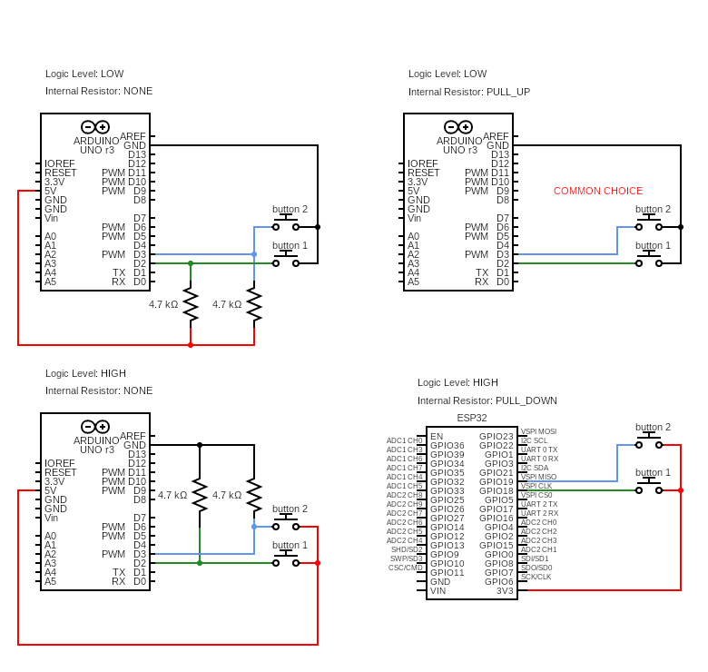

# gnl-button

A lightweight Arduino library for working with a single button or a set of buttons.

The library does not use interrupts and is designed for polling-based input handling. It supports:

* button press detection  
* long-press detection  
* multiple button combinations  

**Requirement:** [gnl-timer](https://github.com/gnoolson/gnl-timer)

**Connection configurations**



## Button

### API
```
// Initialize an existing button  
void gnl_button_setup(gnl_button_t* p_button, int8_t id, uint8_t dev_pin, uint8_t logic_level);
```

```
// Allocate and initialize a new button on the heap  
gnl_button_t* gnl_button_new_and_setup(int8_t id, uint8_t dev_pin, uint8_t logic_level);
```

```
// Setting the long-press and debounce times (default values: long_press = 1000ms; debounce = 200ms)
void gnl_button_set_time_settings(gnl_button_t* p_button, uint16_t long_press_ms, uint16_t debounce_ms);
```

```
// Delete a button allocated on the heap  
void gnl_button_delete(gnl_button_t* p_button);
```

```
// Configure the button pin as an input  
void gnl_button_begin(gnl_button_t* p_button);
```

```
// Update button state. If a button event is detected, the callback function is invoked  
void gnl_button_update(gnl_button_t* p_button, 
                        void (*p_button_callback)(int8_t button_id, bool long_press, void* p_value), 
                        void* p_value);
```

### Example
Two independent buttons

```
extern "C" {
#include <gnl_button.h>
}

gnl_button_t* p_button_1 = NULL;
gnl_button_t* p_button_2 = NULL;

void setup() {
    Serial.begin(9600);

    p_button_1 = gnl_button_new_and_setup(1, 18, LOW);
    p_button_2 = gnl_button_new_and_setup(2, 19, LOW);

    gnl_button_begin(p_button_1, GNL_PULL_UP);
    gnl_button_begin(p_button_2, GNL_PULL_UP);
}

void callback(int8_t button_id, bool long_press, void* p_value) {
    int* p_counter = (int*)p_value;

    Serial.print("button id: ");
    Serial.print(button_id);

    Serial.print(" long_press: ");
    Serial.print(long_press);

    Serial.print(" counter: ");
    Serial.println((*p_counter)++);
}

void loop() {
    static int counter = 0;

    gnl_button_update(p_button_1, &callback, &counter);
    gnl_button_update(p_button_2, &callback, &counter);
}
```

## Set of Buttons
Simultaneous processing of a set of buttons

### API 
```
// Initialize an existing set of buttons  
void gnl_sob_setup(gnl_sob_t* p_sob, uint8_t length, uint8_t logic_level);
```

```
// Allocate and initialize a new set of buttons on the heap  
gnl_sob_t* gnl_sob_new_and_setup(uint8_t length, uint8_t logic_level);
```

```
// Setting the long-press time, debounce time, and callback delay (default values: long_press = 1000ms; debounce = 200ms; delay_ms = 100ms)
void gnl_sob_set_time_settings(gnl_sob_t* p_sob, uint16_t long_press_ms, uint16_t debounce_ms, uint16_t delay_ms);
```

```
// Delete a set of buttons allocated on the heap  
void gnl_sob_delete(gnl_sob_t* p_sob);
```

```
// Add a button to the set  
bool gnl_sob_add_button(gnl_sob_t* p_sob, int8_t button_id, uint8_t dev_pin);
```

```
// Configure all button pins as inputs  
void gnl_sob_begin(gnl_sob_t* p_sob);
```

```
// Update button states in the set. If one or more button events are detected, the callback is invoked  
void gnl_sob_update(gnl_sob_t* p_sob, 
                    void (*callback)(gnl_button_info_t** p_infos, uint8_t length, void* p_value), 
                    void* p_value);
```

### Example
Two buttons in a set

```
extern "C" {
#include <gnl_sob.h>
}

gnl_sob_t* p_sob = NULL;

void setup() {
    Serial.begin(9600);

    p_sob = gnl_sob_new_and_setup(2, LOW);

    gnl_sob_add_button(p_sob, 1, 18);
    gnl_sob_add_button(p_sob, 2, 19);

    gnl_sob_begin(p_sob, GNL_PULL_UP);
}

void callback(gnl_button_info_t** p_infos, uint8_t length, void* p_value) {
    Serial.println(">>");

    for (int i = 0; i < length; i++) {
        Serial.print("button id: ");
        Serial.print(p_infos[i]->button_id);

        Serial.print(" state: ");
        Serial.println(p_infos[i]->state);
    }

    Serial.println("<<");
}

void loop() {
    static int x = 0;
    gnl_sob_update(p_sob, &callback, &x);
}
```
